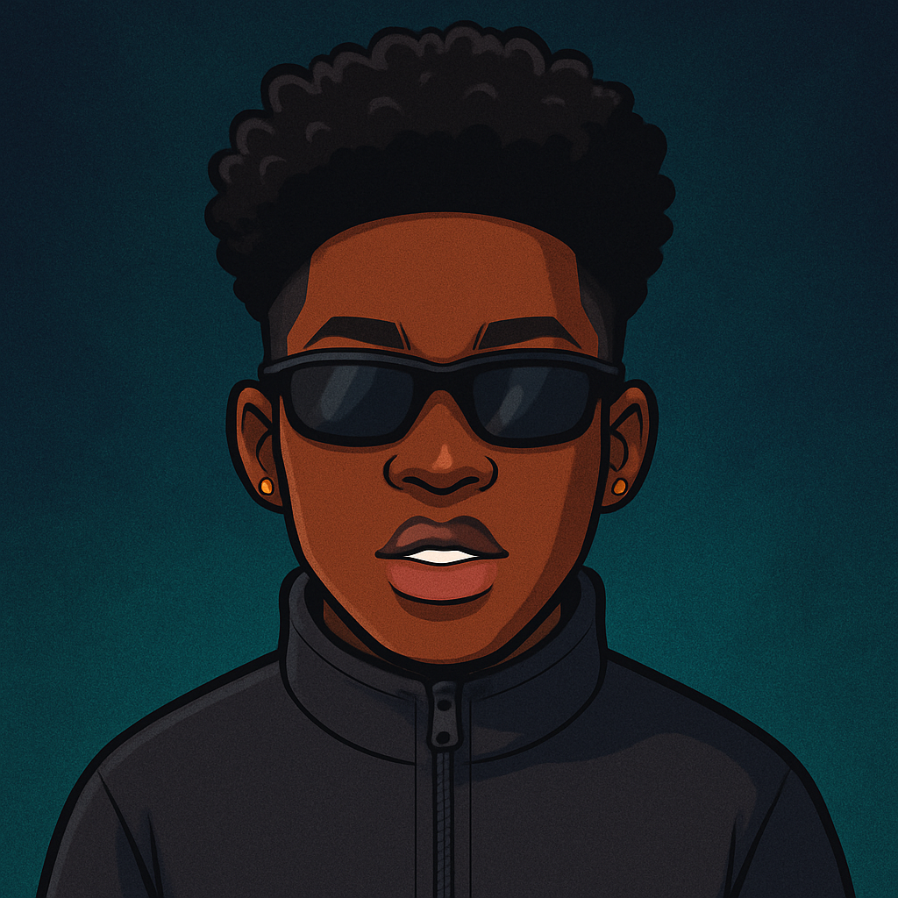

[+ao+meu+repositório!;:%29)](https://git.io/typing-svg)

##
📌Atuando como Desenvolvedor de Software   
📌Cursando o 1º semestre de Sistemas de Informação na Universidade Federal de Juiz de Fora - (UFJF).  
📌Formado no curso técnico em Desenvolvimento de Sistemas.  
📌Sempre em busca de aprendizado e aperfeiçoamento profissional e pessoal!

## 💻 Tech Stack:

    
    
    
    
    
    
    
   
   
   
  
    
     

## 🌐 Socials:
   
##

# 📊 GitHub Stats:
 
 

 

 

 
<b>Visitors Count</b>
  

 
 

---

<!-- Proudly created with GPRM ( https://gprm.itsvg.in ) -->
